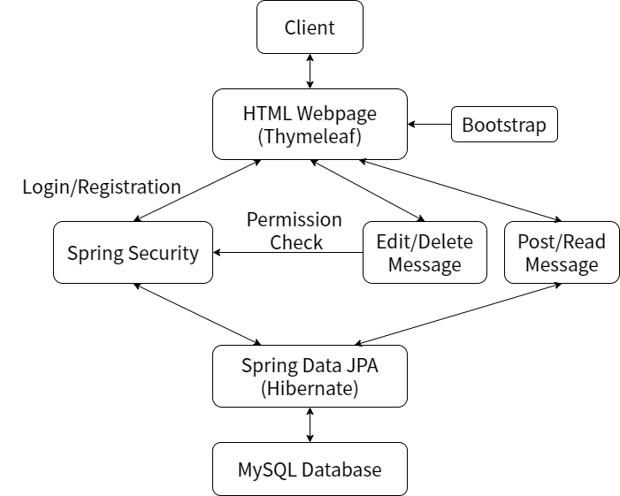

# spring-boot-message-board-system
A message board system based on spring boot, including login and registration function.

## Description

This is a message board system, in which you can register an account, login, post/edit/delete a message all these operations interacts with backend database.

## Credit

Referenced Code (Huge thanks!):

>[registration-login-spring-boot-security-thymeleaf-hibernate  —  RameshMF](https://github.com/RameshMF/registration-login-spring-boot-security-thymeleaf-hibernate)

## Dependencies

- Frontend: Thymeleaf, Bootstrap
- Backend: Spring Boot, Spring Web MVC, Spring Data JPA (Hibernate), Spring Security
- Dependency management: Maven
- Database: MySQL

## Extra Functions

Besides the basic functions described above, there are some more, including:

1. Automatically add message sent time to a message object, and automatically renew it when message is updated.

2. Automatically add message author depending on the logged in user.

3. Login as guest.

4. Permission control as below:

   | Roles                          | ADMIN | USER  | GUEST |
   | ------------------------------ | ----- | ----- | ----- |
   | Post/Read Message              | **✓** | **✓** | **✓** |
   | Edit/Delete GUEST Message      | **✓** | **✓** | **✓** |
   | Edit/Delete USER (own) Message | **✓** | **✓** |       |
   | Edit/Delete ADMIN Message      | **✓** |       |       |

## Program logic

The logic of the whole project is as shown below:

## Warnings

Given that this is a small project, some drawbacks are ignored for convenience, including:

1. Permissions are depended on usernames rather than roles, which is not what we want.
2. "Login as guest" is achieved by JavaScript at frontend rather than backend.
3. Multiple functions are achieved by hardcoding.
4. Inline CSS or "style purpose HTML" are used.
